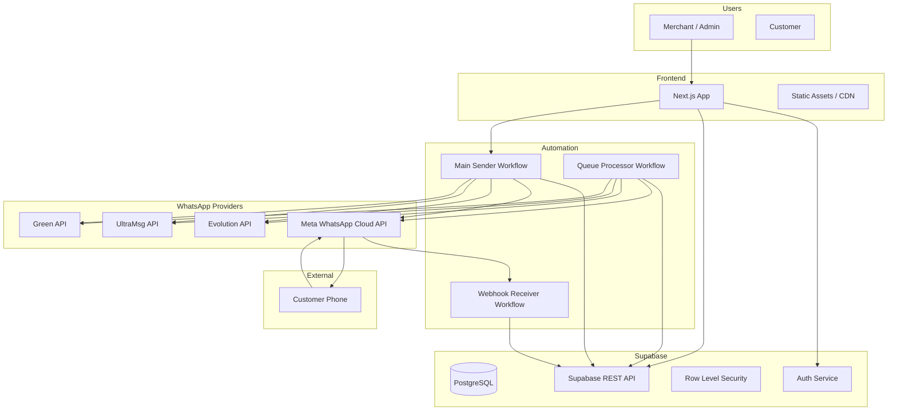
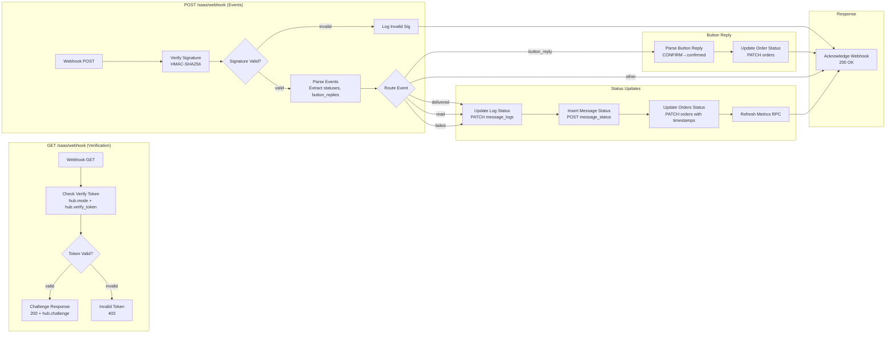
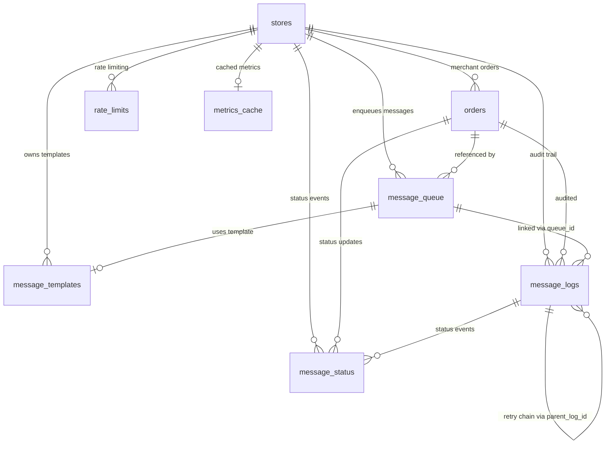
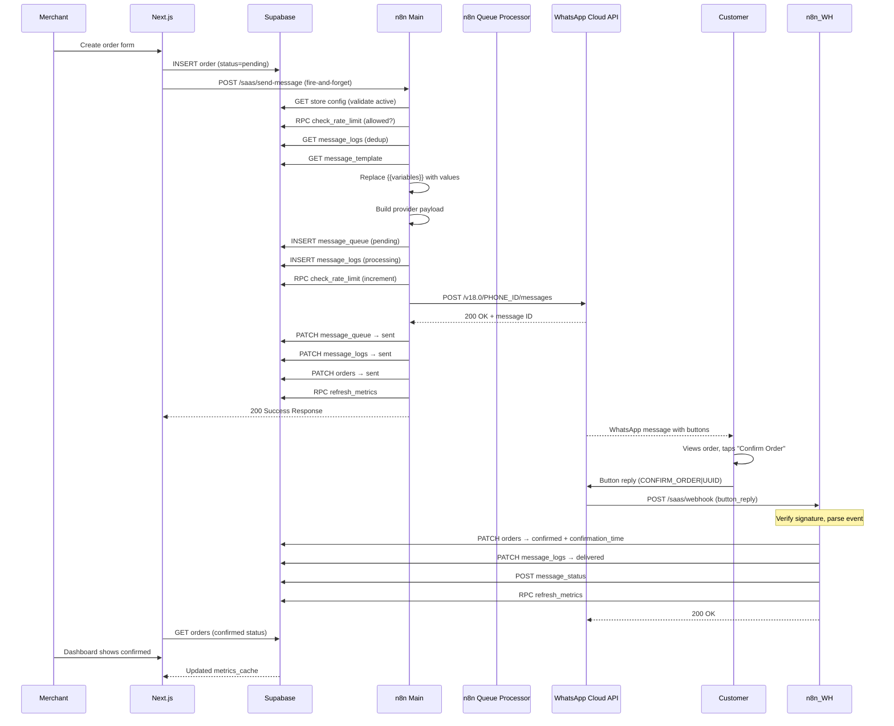
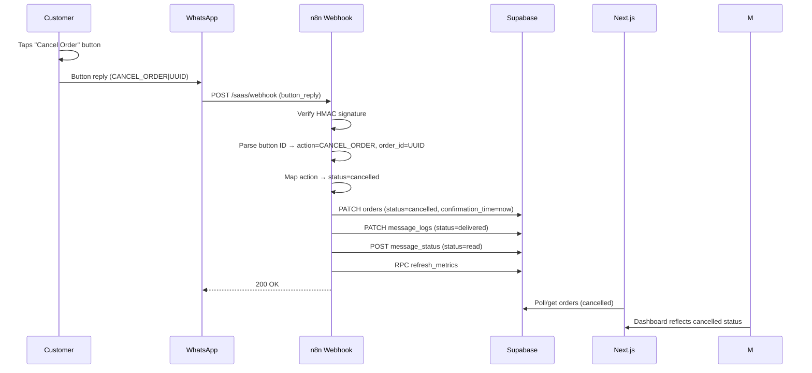
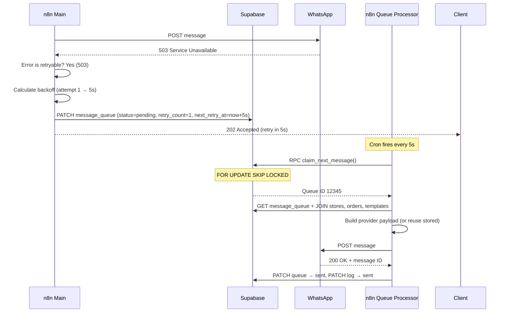
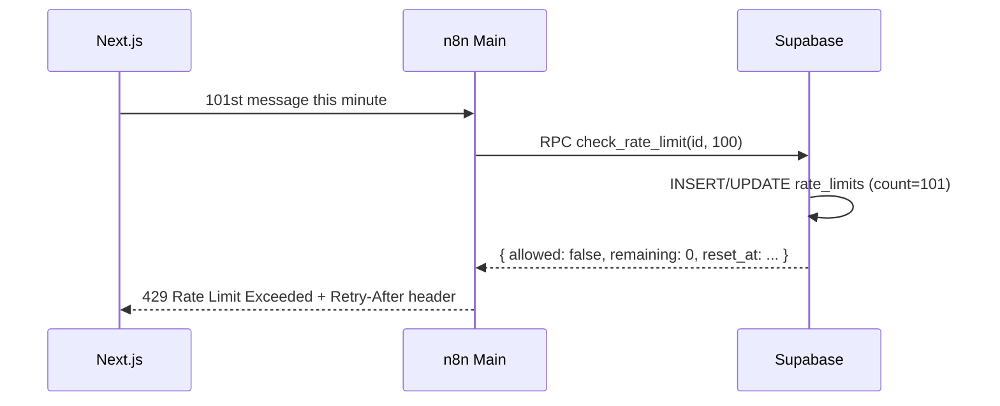
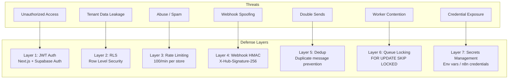
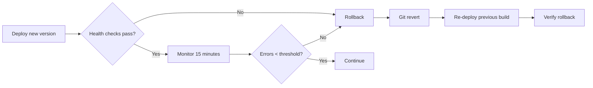

# SaaS Platform — Architecture & Operations Documentation

> **Version:** 1.0.0  
> **Stack:** Next.js 14 · Supabase · n8n · Meta WhatsApp Cloud API · Docker  
> **Last Updated:** 2026-06-26

---

## Table of Contents

1. [System Architecture](#1-system-architecture)
2. [Workflow Diagrams](#2-workflow-diagrams)
3. [Database Schema](#3-database-schema)
4. [Sequence Diagrams](#4-sequence-diagrams)
5. [Deployment Guide](#5-deployment-guide)
6. [Security Architecture](#6-security-architecture)
7. [Monitoring](#7-monitoring)
8. [Scaling Guide](#8-scaling-guide)
9. [Disaster Recovery](#9-disaster-recovery)
10. [API Documentation](#10-api-documentation)
11. [Environment Variables](#11-environment-variables)
12. [Production Checklist](#12-production-checklist)

---

## 1. System Architecture

### High-Level Overview



### Component Responsibilities

| Component | Role |
|---|---|
| **Next.js Frontend** | Merchant dashboard, order management, settings, authentication UI, landing pages |
| **Supabase Auth** | JWT-based authentication, session management, Row Level Security |
| **Supabase Database** | All persistent state: stores, orders, templates, queue, logs, metrics |
| **n8n — Main Sender** | Entry point `POST /saas/send-message` — validates, rate-limits, deduplicates, sends via provider |
| **n8n — Webhook Receiver** | Meta webhook verification + status callbacks (delivered, read, failed, button reply) |
| **n8n — Queue Processor** | Background worker (cron 5s) — drains pending/retry queue with exponential backoff |
| **Meta WhatsApp Cloud API** | Primary provider — sends messages, delivers status webhooks |
| **Evolution / UltraMsg / Green API** | Alternative providers for regions/use cases where Meta is unavailable |

### Data Flow (Simplified)

```
1. Merchant creates order in Next.js UI
2. Order inserted into Supabase (orders table)
3. Browser fire-and-forgets POST to n8n webhook
4. Main Sender workflow: validate → rate limit → dedup → template → queue → send
5. Queue Processor picks up async retries (backoff: 5s → 15s → 30s → 60s → 300s)
6. Meta delivers message to customer
7. Customer taps Confirm/Cancel button
8. Meta sends webhook POST to Webhook Receiver
9. Webhook Receiver updates order status, message_logs, metrics
```

---

## 2. Workflow Diagrams

### 2.1 Main Sender (`saas.json`) — 38 Nodes

```mermaid
flowchart LR
    subgraph "1. Entry"
        WH[Webhook POST /saas/send-message]
    end

    subgraph "2. Validation"
        VAL[Validate Request<br/>Check 9 required fields]
        VAL_ERR[Build Validation Error]
        ERR_400[Error Response 400]
    end

    subgraph "3. Store Config"
        STORE[Fetch Store Config<br/>GET /rest/v1/stores?id=]
        CHK_ACT[Check Store Active<br/>active? maintenance? paused?]
        STORE_ERR[Build Store Error]
        ERR_403[Store Error Response 403]
    end

    subgraph "4. Rate Limiting"
        RL[Check Rate Limit<br/>RPC check_rate_limit]
        RL_OK[Rate Limit OK?]
        RL_ERR[Rate Limit Error 429]
    end

    subgraph "5. Deduplication"
        DUP[Check Duplicate<br/>GET message_logs?order_id=]
        IS_DUP[Is Duplicate?]
        DUP_RESP[Duplicate Response 200]
    end

    subgraph "6. Template Engine"
        TPL[Fetch Template<br/>GET message_templates]
        VARS[Replace Variables<br/>JSON.stringify replacer]
    end

    subgraph "7. Queue & Log"
        PAYLOAD[Build Provider Payload<br/>Supports 4 providers, 10+ types]
        Q_INS[Insert Queue<br/>POST message_queue]
        LOG_INS[Insert Log<br/>POST message_logs]
        RL_INC[Increment Rate Limit<br/>RPC check_rate_limit]
    end

    subgraph "8. Send"
        ROUTE[Route Provider<br/>meta|ultramsg|greenapi|evolution]
        SEND[Send via Provider<br/>Generic HTTP Request]
        PARSE[Parse Provider Response<br/>Extract msgId, errors]
        SEND_OK[Send Successful?]
    end

    subgraph "9. Success Path"
        Q_SENT[Update Queue Sent]
        LOG_SENT[Update Log Sent]
        ORD_SENT[Update Orders Sent]
        METRICS[Refresh Metrics RPC]
        RESP_200[Success Response 200]
    end

    subgraph "10. Retry Path"
        RETRYABLE[Is Retryable?<br/>429,500,502,503,504]
        BACKOFF[Calculate Backoff<br/>5,15,30,60,300s]
        MAX_RETRY[Max Retries Reached?]
        Q_RETRY[Update Queue Retry]
        LOG_RETRY[Update Log Retry]
        RESP_202[Retry Response 202]
    end

    subgraph "11. Failure Path"
        Q_FAIL[Update Queue Failed]
        ORD_FAIL[Update Orders Failed]
        RESP_500[Error Response 500]
    end

    WH --> VAL
    VAL -->|valid| STORE
    VAL -->|invalid| VAL_ERR --> ERR_400

    STORE --> CHK_ACT
    CHK_ACT -->|active| RL
    CHK_ACT -->|disabled| STORE_ERR --> ERR_403

    RL --> RL_OK
    RL_OK -->|allowed| DUP
    RL_OK -->|exceeded| RL_ERR

    DUP --> IS_DUP
    IS_DUP -->|new| TPL
    IS_DUP -->|duplicate| DUP_RESP

    TPL --> VARS --> PAYLOAD --> Q_INS --> LOG_INS --> RL_INC --> ROUTE
    ROUTE -->|all providers| SEND --> PARSE --> SEND_OK

    SEND_OK -->|success| Q_SENT --> LOG_SENT --> ORD_SENT --> METRICS --> RESP_200
    SEND_OK -->|failure| RETRYABLE

    RETRYABLE -->|retryable| BACKOFF --> MAX_RETRY
    RETRYABLE -->|non-retryable| Q_FAIL --> ORD_FAIL --> RESP_500
    MAX_RETRY -->|under limit| Q_RETRY --> LOG_RETRY --> RESP_202
    MAX_RETRY -->|maxed| Q_FAIL --> ORD_FAIL --> RESP_500
```

#### Node Details

| # | Node | Type | Action | Notes |
|---|---|---|---|---|
| 1 | Webhook | n8n-nodes-base.webhook | Receives POST /saas/send-message | Entry point |
| 2 | Validate Request | If | Checks 9 required fields: order_id, store_id, customer_name, phone, product, amount, currency, language, store_name | All-or-nothing |
| 3 | Build Validation Error | Code | Lists missing field names | Dynamic error msg |
| 4 | Error Response 400 | RespondToWebhook | Returns 400 with missing fields | Short-circuit |
| 5 | Fetch Store Config | HTTP Request (GET) | Supabase: stores table by id | Uses Accept: vnd.pgrst.object+json |
| 6 | Check Store Active | If | Verifies active=true, maintenance_mode=false, sending_paused=false | Three conditions |
| 7 | Build Store Error | Code | Descriptive reason for 403 | Per-condition message |
| 8 | Store Error Response | RespondToWebhook | Returns 403 with error | Short-circuit |
| 9 | Check Rate Limit | HTTP Request (POST) | RPC check_rate_limit(p_store_id, p_max_per_minute) | Atomic upsert + count |
| 10 | Rate Limit OK? | If | Checks allowed boolean from RPC | Decision point |
| 11 | Rate Limit Error | RespondToWebhook | Returns 429 with Retry-After header | Rate limited |
| 12 | Check Duplicate | HTTP Request (GET) | Queries message_logs for existing sent messages with same order_id | Prevents double-send |
| 13 | Is Duplicate? | If | Checks if result array is empty | Decision point |
| 14 | Duplicate Response | RespondToWebhook | Returns 200 with status=duplicate | Idempotent |
| 15 | Fetch Template | HTTP Request (GET) | GET message_templates by store_id, name, language | Falls back gracefully |
| 16 | Replace Variables | Code | Recursive JSON replacer for {{variable}} patterns | Supports 8 variables |
| 17 | Build Provider Payload | Code | Dynamic URL/headers/body for all 4 providers, 10+ message types | The most complex node |
| 18 | Insert Queue | HTTP Request (POST) | Inserts pending message_queue row | Returns representation |
| 19 | Insert Log | HTTP Request (POST) | Inserts message_logs audit entry | Links to queue via queue_id |
| 20 | Increment Rate Limit | HTTP Request (POST) | Same RPC as step 9 — second call increments | Final count |
| 21 | Route Provider | Switch | Routes to meta/ultramsg/greenapi/evolution | All converge to same Send node |
| 22 | Send via Provider | HTTP Request (POST) | Generic send — URL/headers/body from _provider_payload | continueOnFail enabled |
| 23 | Parse Provider Response | Code | Extracts msgId, detects retryable errors | Retry codes: 429,500,502,503,504 |
| 24 | Send Successful? | If | Branches on _send_success | Decision point |
| 25 | Update Queue Sent | HTTP Request (PATCH) | Marks queue as sent, releases lock | — |
| 26 | Update Log Sent | HTTP Request (PATCH) | Updates log with msgId, response, timing | — |
| 27 | Update Orders Sent | HTTP Request (PATCH) | Updates order status to sent | — |
| 28 | Refresh Metrics | HTTP Request (POST) | RPC refresh_metrics(p_store_id) | Keeps dashboard live |
| 29 | Success Response | RespondToWebhook | Returns 200 with order_id, msgId, exec time | Happy path |
| 30 | Is Retryable? | If | Checks _is_retryable flag from parsing | Decision point |
| 31 | Calculate Backoff | Code | Computes next_retry_at: 5/15/30/60/300s | Index-safe |
| 32 | Max Retries Reached? | If | Check retry_count >= 5 | Decision point |
| 33 | Update Queue Retry | HTTP Request (PATCH) | Status→pending, increments retry_count, sets next_retry_at | Releases lock |
| 34 | Update Log Retry | HTTP Request (PATCH) | Marks log as failed for this attempt | Links via parent_log_id |
| 35 | Retry Response | RespondToWebhook | Returns 202 with retry info | Accepted |
| 36 | Update Queue Failed | HTTP Request (PATCH) | Status→failed, permanent | Max retries or non-retryable |
| 37 | Update Orders Failed | HTTP Request (PATCH) | Status→failed, error_message | Merchants see this |
| 38 | Error Response 500 | RespondToWebhook | Returns 500 with error | Terminal failure |

### 2.2 Webhook Receiver (`saas-webhook-receiver.json`) — 18 Nodes



#### Key Behaviors

- **Verification:** Meta sends `GET /saas/webhook?hub.mode=subscribe&hub.verify_token=...&hub.challenge=...`. The workflow validates `hub.verify_token` against `META_WEBHOOK_VERIFY_TOKEN` and returns `hub.challenge` as plaintext.
- **Signature Validation:** Every POST is validated with `X-Hub-Signature-256` (HMAC-SHA256 of raw body using `META_WEBHOOK_SECRET`). Invalid signatures are logged and acknowledged (200) to prevent Meta retries.
- **Event Parsing:** Extracts `delivered`, `read`, `failed` statuses and `button_reply` interactions from Meta's `entry[0].changes[0].value` structure.
- **Button Replies:** Parses button ID format `CONFIRM_ORDER|{order_id}` or `CANCEL_ORDER|{order_id}`. Updates `orders.status` accordingly.
- **Status Updates:** Each status event (delivered/read/failed) updates `message_logs`, inserts into `message_status`, updates `orders` with appropriate timestamps, and refreshes metrics.

### 2.3 Queue Processor (`saas-queue-processor.json`) — 23 Nodes

```mermaid
flowchart LR
    subgraph "Trigger"
        CRON[Cron Every 5s]
        FAN[Fan Out batch=10]
    end

    subgraph "Claim"
        CLAIM[Claim Next Message<br/>RPC claim_next_message(2)]
        CLAIMED{Claimed?}
    end

    subgraph "Fetch"
        EXT_ID[Extract Queue ID]
        FETCH[Fetch Queue Record<br/>JOIN stores, orders, templates]
        FOUND{Record Found?}
    end

    subgraph "Send"
        BUILD[Build Provider Payload<br/>Stored or rebuilt from template]
        SEND_QP[Send via Provider<br/>Generic HTTP]
        PARSE_QP[Parse Response]
        SEND_OK_QP{Send Successful?}
    end

    subgraph "Success"
        Q_SENT_QP[Update Queue Sent]
        LOG_SENT_QP[Update Log Sent]
        ORD_SENT_QP[Update Orders Sent]
        M_SENT[Refresh Metrics]
    end

    subgraph "Retry"
        CALC_BO[Calculate Backoff<br/>5,15,30,60,300s]
        MAX_R{M Retries?}
        Q_RET_QP[Update Queue Retry<br/>→pending + next_retry_at]
        LOG_RET_QP[Update Log Retry<br/>→pending]
        M_RET[Refresh Metrics]
    end

    subgraph "Failure"
        Q_FAIL_QP[Update Queue Failed]
        LOG_FAIL_QP[Update Log Failed]
        ORD_FAIL_QP[Update Orders Failed]
        M_FAIL[Refresh Metrics]
    end

    CRON --> FAN --> CLAIM --> CLAIMED
    CLAIMED -->|has ID| EXT_ID --> FETCH --> FOUND
    CLAIMED -->|null| END((end))
    FOUND -->|found| BUILD --> SEND_QP --> PARSE_QP --> SEND_OK_QP
    FOUND -->|not found| END

    SEND_OK_QP -->|success| Q_SENT_QP --> LOG_SENT_QP --> ORD_SENT_QP --> M_SENT --> END
    SEND_OK_QP -->|failure| CALC_BO --> MAX_R

    MAX_R -->|under limit| Q_RET_QP --> LOG_RET_QP --> M_RET --> END
    MAX_R -->|maxed| Q_FAIL_QP --> LOG_FAIL_QP --> ORD_FAIL_QP --> M_FAIL --> END
```

#### Key Behaviors

- **Cron:** Fires every 5 seconds. Each invocation fans out to 10 parallel paths (batch processing).
- **Claiming:** Each parallel path calls `claim_next_message(2)` RPC, which atomically locks a pending queue row with `FOR UPDATE SKIP LOCKED`. The lock expires after 2 minutes (prevents stuck workers).
- **Fetch:** Reads the queue row with JOINs to `stores`, `orders`, `message_templates` — all data needed for sending in a single query.
- **Payload Building:** If the queue already has a stored `payload`, it's reused directly. Otherwise, the template + variables are resolved again (backward compatibility with legacy items).
- **Send:** Generic HTTP request — URL, headers, body fully dynamic from `_provider_payload`.
- **Backoff:** Exponential: attempt 1 → 5s, 2 → 15s, 3 → 30s, 4 → 60s, 5 → 300s (terminal).
- **State Transitions:**
  - `pending` → `processing` (claimed by RPC)
  - `processing` → `sent` (success) or `pending` (retry) or `failed` (terminal)

---

## 3. Database Schema

### Entity-Relationship Diagram



### Table Definitions

#### `stores` — Merchant / Tenant Configuration

| Column | Type | Constraints | Description |
|---|---|---|---|
| id | uuid | PK, default gen_random_uuid() | Unique store identifier |
| name | text | NOT NULL | Store display name |
| slug | text | UNIQUE | URL-friendly identifier |
| whatsapp_provider | text | NOT NULL, CHECK('meta','ultramsg','greenapi','evolution') | Active provider |
| phone_number_id | text | | Meta Cloud API phone number ID |
| access_token | text | | Provider API token (encrypted at rest) |
| business_account_id | text | | Meta Business Account ID |
| webhook_secret | text | | Per-store webhook secret |
| template_name | text | DEFAULT 'order_confirmation' | Default template |
| language | text | DEFAULT 'fr' | Message language |
| rate_limit_per_minute | integer | NOT NULL, DEFAULT 100 | Max messages per minute |
| channels | jsonb | DEFAULT '{"whatsapp":true}' | Future channel routing |
| active | boolean | NOT NULL, DEFAULT true | Store enabled/disabled |
| maintenance_mode | boolean | NOT NULL, DEFAULT false | Maintenance block |
| sending_paused | boolean | NOT NULL, DEFAULT false | Pause sends |
| paused_at | timestamptz | | When paused |
| paused_reason | text | | Why paused |
| created_at | timestamptz | NOT NULL, DEFAULT now() | Row creation |
| updated_at | timestamptz | NOT NULL, DEFAULT now() | Row update (trigger) |

**Indexes:** `idx_stores_slug` (slug), `idx_stores_active` (active) WHERE active=true

#### `message_templates` — WhatsApp Message Templates

| Column | Type | Constraints | Description |
|---|---|---|---|
| id | uuid | PK, default gen_random_uuid() | Template ID |
| store_id | uuid | NOT NULL, FK → stores(id) ON DELETE CASCADE | Owning store |
| name | text | NOT NULL | Template name (e.g., 'order_confirmation') |
| language | text | NOT NULL, DEFAULT 'fr' | Template language |
| message_type | text | NOT NULL, CHECK('text','template','interactive','list','image','document','audio','video','location','contacts') | Message type |
| content | jsonb | NOT NULL | Flexible content with {{variable}} placeholders |
| variables | text[] | DEFAULT '{}' | Expected variable names |
| active | boolean | NOT NULL, DEFAULT true | Template enabled |
| created_at | timestamptz | NOT NULL, DEFAULT now() | Row creation |
| updated_at | timestamptz | NOT NULL, DEFAULT now() | Row update (trigger) |

**Indexes:** `idx_msg_templates_store` (store_id), `idx_msg_templates_name` (store_id, name, language)

#### `orders` — Orders from Merchant App

| Column | Type | Constraints | Description |
|---|---|---|---|
| order_id | uuid | PK | Order UUID (from frontend) |
| store_id | uuid | NOT NULL, FK → stores(id) | Owning store |
| customer_name | text | NOT NULL | Customer name |
| phone | text | NOT NULL | Customer phone number |
| product | text | | Product name |
| amount | numeric | | Order amount |
| currency | text | DEFAULT 'DA' | Currency code |
| language | text | DEFAULT 'fr' | Preferred language |
| store_name | text | | Store name (denormalized) |
| message_type | text | DEFAULT 'interactive' | Message type to send |
| status | text | NOT NULL, DEFAULT 'pending', CHECK(enum) | Lifecycle state |
| provider | text | | Which provider sent |
| provider_message_id | text | | Provider's message ID |
| sent_at | timestamptz | | When sent |
| delivered_at | timestamptz | | When delivered |
| read_at | timestamptz | | When read |
| confirmation_time | timestamptz | | When customer confirmed |
| error_message | text | | Failure reason |
| retry_count | integer | NOT NULL, DEFAULT 0 | Retry attempts |
| created_at | timestamptz | NOT NULL, DEFAULT now() | Row creation |
| updated_at | timestamptz | NOT NULL, DEFAULT now() | Row update (trigger) |

**Indexes:** `idx_orders_store`, `idx_orders_phone`, `idx_orders_status`, `idx_orders_provider_msg`, `idx_orders_created`

**Status lifecycle:** `pending` → `queued` → `sent` → `delivered` → `read` → `confirmed` | `cancelled` | `failed` | `duplicate`

#### `message_queue` — Async Processing & Retry Queue

| Column | Type | Constraints | Description |
|---|---|---|---|
| id | bigserial | PK | Auto-incrementing queue ID |
| store_id | uuid | NOT NULL, FK → stores(id) | Owning store |
| order_id | uuid | FK → orders(order_id) | Related order |
| phone | text | NOT NULL | Recipient phone |
| message_type | text | NOT NULL, DEFAULT 'interactive' | Message type |
| payload | jsonb | | Complete provider HTTP payload |
| template_id | uuid | FK → message_templates(id) | Used template |
| variables | jsonb | | Resolved variables |
| message_hash | text | | SHA-256 for dedup |
| status | text | NOT NULL, DEFAULT 'pending', CHECK(enum) | Queue state |
| priority | integer | NOT NULL, DEFAULT 0 | Priority (higher = first) |
| locked_at | timestamptz | | Worker lock timestamp |
| locked_by | text | | Worker identifier |
| lock_token | uuid | | Lock token for safe release |
| retry_count | integer | NOT NULL, DEFAULT 0 | Current retry attempt |
| max_retries | integer | NOT NULL, DEFAULT 5 | Max retries before permanent failure |
| next_retry_at | timestamptz | | Earliest retry time |
| last_error | text | | Most recent error message |
| created_at | timestamptz | NOT NULL, DEFAULT now() | Row creation |
| updated_at | timestamptz | NOT NULL, DEFAULT now() | Row update (trigger) |

**Indexes:**
- `idx_queue_message_hash` UNIQUE WHERE status='pending' (dedup enforcement)
- `idx_queue_pending` ON (status, next_retry_at) WHERE status='pending' AND (next_retry_at IS NULL OR next_retry_at <= now())
- `idx_queue_processing` ON (locked_at) WHERE status='processing'

**Status enum:** `pending` | `processing` | `sent` | `failed` | `duplicate` | `cancelled`

#### `message_logs` — Complete Audit Trail

| Column | Type | Constraints | Description |
|---|---|---|---|
| id | bigserial | PK | Auto-incrementing log ID |
| queue_id | bigint | FK → message_queue(id) | Related queue item |
| store_id | uuid | NOT NULL, FK → stores(id) | Owning store |
| order_id | uuid | FK → orders(order_id) | Related order |
| phone | text | NOT NULL | Recipient phone |
| provider | text | | Provider name |
| message_type | text | | Message type |
| template_name | text | | Template used |
| variables | jsonb | | Resolved variables |
| payload | jsonb | | Full request payload |
| response | jsonb | | Full provider response |
| provider_message_id | text | | Provider's message ID |
| status | text | NOT NULL, DEFAULT 'pending', CHECK(enum) | Log status |
| error_message | text | | Error text |
| error_code | text | | Error code |
| execution_time_ms | integer | | Request duration |
| attempt_number | integer | NOT NULL, DEFAULT 1 | Which attempt |
| parent_log_id | bigint | FK → message_logs(id) | Links retry chain |
| created_at | timestamptz | NOT NULL, DEFAULT now() | Row creation |

**Indexes:** `idx_msg_logs_store`, `idx_msg_logs_order`, `idx_msg_logs_provider_msg`, `idx_msg_logs_created`, `idx_msg_logs_status`

#### `message_status` — Delivery/Read Webhook Events

| Column | Type | Constraints | Description |
|---|---|---|---|
| id | bigserial | PK | Auto-incrementing |
| provider_message_id | text | NOT NULL | From provider |
| log_id | bigint | FK → message_logs(id) | Related log entry |
| store_id | uuid | FK → stores(id) | Owning store |
| status | text | NOT NULL, CHECK('delivered','read','failed') | Event type |
| error_message | text | | Error detail |
| recipient_id | text | | Recipient WA ID |
| timestamp | timestamptz | | Event time |
| raw_payload | jsonb | | Raw webhook body |
| created_at | timestamptz | NOT NULL, DEFAULT now() | Row creation |

**Indexes:** `idx_msg_status_provider` (provider_message_id), `idx_msg_status_log` (log_id)

#### `rate_limits` — Per-Store Minute Buckets

| Column | Type | Constraints | Description |
|---|---|---|---|
| id | bigserial | PK | Auto-incrementing |
| store_id | uuid | NOT NULL, FK → stores(id) | Owning store |
| bucket_minute | timestamptz | NOT NULL | Truncated to minute |
| count | integer | NOT NULL, DEFAULT 0 | Request count this minute |
| created_at | timestamptz | NOT NULL, DEFAULT now() | Row creation |

**Constraint:** UNIQUE(store_id, bucket_minute)

#### `metrics_cache` — Pre-Computed Dashboard Metrics

| Column | Type | Constraints | Description |
|---|---|---|---|
| store_id | uuid | PK, FK → stores(id) | Owning store |
| messages_sent | integer | NOT NULL, DEFAULT 0 | Total sent (30 days) |
| messages_delivered | integer | NOT NULL, DEFAULT 0 | Total delivered |
| messages_read | integer | NOT NULL, DEFAULT 0 | Total read |
| messages_failed | integer | NOT NULL, DEFAULT 0 | Total failed |
| messages_pending | integer | NOT NULL, DEFAULT 0 | Currently pending |
| orders_confirmed | integer | NOT NULL, DEFAULT 0 | Total confirmed |
| orders_cancelled | integer | NOT NULL, DEFAULT 0 | Total cancelled |
| avg_response_time_ms | integer | NOT NULL, DEFAULT 0 | Avg confirmation time |
| delivery_rate | numeric(5,2) | NOT NULL, DEFAULT 0 | Delivered/sent % |
| read_rate | numeric(5,2) | NOT NULL, DEFAULT 0 | Read/delivered % |
| confirmation_rate | numeric(5,2) | NOT NULL, DEFAULT 0 | (confirmed+cancelled)/sent % |
| updated_at | timestamptz | NOT NULL, DEFAULT now() | Last refresh |

### Stored Procedures

#### `check_rate_limit(p_store_id, p_max_per_minute) → jsonb`

Atomically increments and checks the per-store rate limit:

```sql
RETURNS { allowed: boolean, remaining: integer, reset_at: timestamptz }
```

- Uses `INSERT ... ON CONFLICT DO UPDATE` for atomic increment.
- Returns remaining quota in current minute window.
- Called twice per message: once to check, once to confirm (deduct).

#### `claim_next_message(p_lock_minutes) → bigint`

Atomically claims the next pending queue message:

```sql
UPDATE message_queue SET status='processing', locked_at=now(), locked_by=..., lock_token=...
WHERE id = (SELECT id FROM message_queue WHERE status='pending' AND (next_retry_at IS NULL OR next_retry_at <= now())
            ORDER BY priority DESC, created_at ASC LIMIT 1 FOR UPDATE SKIP LOCKED)
RETURNING id
```

- `FOR UPDATE SKIP LOCKED` prevents worker contention.
- Lock token enables safe release by any worker.
- Lock auto-expires after `p_lock_minutes` (default 2).

#### `refresh_metrics(p_store_id) → void`

Recalculates metrics from `orders` table (last 30 days):

```sql
INSERT INTO metrics_cache (...) VALUES (...)
ON CONFLICT (store_id) DO UPDATE SET ...
```

- Called after every send, status update, and button reply.

#### `cleanup_rate_limits() → void`

Deletes rate limit buckets older than 24 hours. Should be scheduled via pg_cron.

### Health Check View — `v_health`

```sql
SELECT
  'database' AS component,
  'healthy' AS status,
  now() AS server_time,
  (SELECT count(*) FROM pg_stat_activity) AS connections,
  (SELECT count(*) FROM stores WHERE active = true) AS active_stores,
  (SELECT count(*) FROM message_queue WHERE status='pending' AND (next_retry_at IS NULL OR next_retry_at <= now())) AS queue_depth,
  (SELECT extract(epoch FROM (now() - min(created_at)))::int FROM message_logs) AS uptime_seconds;
```

### Row Level Security (RLS)

RLS is configured on all tables. Merchants can only access their own data. Admins bypass via service role.

| Table | RLS Policy |
|---|---|
| stores | `USING (id = auth.jwt() ->> 'store_id')` |
| orders | `USING (store_id = auth.jwt() ->> 'store_id')` |
| message_templates | `USING (store_id = auth.jwt() ->> 'store_id')` |
| message_queue | `USING (store_id = auth.jwt() ->> 'store_id')` |
| message_logs | `USING (store_id = auth.jwt() ->> 'store_id')` |
| metrics_cache | `USING (store_id = auth.jwt() ->> 'store_id')` |

The service role key (`SUPABASE_SERVICE_KEY`) bypasses all RLS and is used by n8n workflows and admin API routes.

---

## 4. Sequence Diagrams

### 4.1 Happy Path — Confirm Order



### 4.2 Cancel Order Flow



### 4.3 Retry Flow (Transient Error)



### 4.4 Rate Limiting Flow



---

## 5. Deployment Guide

### 5.1 Docker Compose

```yaml
version: "3.9"

services:
  n8n:
    image: n8nio/n8n:latest
    restart: unless-stopped
    ports:
      - "5678:5678"
    environment:
      - N8N_HOST=n8n.yourdomain.com
      - N8N_PROTOCOL=https
      - N8N_PORT=5678
      - WEBHOOK_URL=https://n8n.yourdomain.com
      - DB_TYPE=postgresdb
      - DB_POSTGRESDB_HOST=supabase-db-host
      - DB_POSTGRESDB_PORT=5432
      - DB_POSTGRESDB_DATABASE=postgres
      - DB_POSTGRESDB_USER=postgres
      - DB_POSTGRESDB_PASSWORD=${SUPABASE_DB_PASSWORD}
      - N8N_ENCRYPTION_KEY=${N8N_ENCRYPTION_KEY}
      - N8N_METRICS=true
      - N8N_METRICS_INCLUDE_DEFAULT_METRICS=true
      - EXECUTIONS_DATA_PRUNE=true
      - EXECUTIONS_DATA_MAX_AGE=168
    volumes:
      - n8n_data:/home/node/.n8n
    networks:
      - saas_network

  nginx:
    image: nginx:alpine
    restart: unless-stopped
    ports:
      - "80:80"
      - "443:443"
    volumes:
      - ./nginx/nginx.conf:/etc/nginx/nginx.conf
      - ./nginx/ssl:/etc/nginx/ssl
      - certbot_data:/var/www/certbot
    depends_on:
      - n8n
    networks:
      - saas_network

volumes:
  n8n_data:
  certbot_data:

networks:
  saas_network:
    driver: bridge
```

### 5.2 n8n Configuration

```env
# Required environment variables for n8n
N8N_HOST=n8n.yourdomain.com
N8N_PROTOCOL=https
N8N_PORT=5678
WEBHOOK_URL=https://n8n.yourdomain.com

# Database (use Supabase PostgreSQL connection pooling)
DB_TYPE=postgresdb
DB_POSTGRESDB_HOST=aws-0-eu-west-1.pooler.supabase.com
DB_POSTGRESDB_PORT=6543
DB_POSTGRESDB_DATABASE=postgres
DB_POSTGRESDB_USER=postgres.{project_ref}
DB_POSTGRESDB_PASSWORD=${SUPABASE_DB_PASSWORD}
DB_POSTGRESDB_SCHEMA=public

# Encryption
N8N_ENCRYPTION_KEY=${N8N_ENCRYPTION_KEY}

# Workflow credentials are injected as environment variables
SUPABASE_URL=https://vqdfmbiqlbwfvvgjkops.supabase.co
SUPABASE_SERVICE_KEY=${SUPABASE_SERVICE_ROLE_KEY}
META_WEBHOOK_VERIFY_TOKEN=${META_WEBHOOK_VERIFY_TOKEN}
META_WEBHOOK_SECRET=${META_WEBHOOK_SECRET}
```

### 5.3 Supabase Setup

1. **Create project** at [supabase.com](https://supabase.com)
2. **Run migrations** in order:
   ```bash
   psql "$SUPABASE_DB_URL" -f migrations/001_schema.sql
   ```
3. **Enable extensions**: `pgcrypto`, `pg_stat_statements`
4. **Configure Auth**:
   - Site URL: `https://yourdomain.com`
   - Redirect URLs: `https://yourdomain.com/**`
   - JWT expiry: 36000 seconds (10 hours)
5. **Set up RLS policies** for all tables (see Section 3)
6. **Service role key**: Copy from Supabase dashboard → Settings → API → `service_role key`

### 5.4 Meta WhatsApp Cloud API Setup

1. Create/use a **Meta Business Account** at [business.facebook.com](https://business.facebook.com)
2. Register a **WhatsApp Business Account** (WABA)
3. Create a **System User** with `whatsapp_business_messaging` and `whatsapp_business_management` permissions
4. Generate an **access token** for the system user
5. Configure **webhook**:
   - Callback URL: `https://n8n.yourdomain.com/webhook/saas/webhook`
   - Verify Token: Match `META_WEBHOOK_VERIFY_TOKEN`
   - Subscribe to: `messages`, `message_deliveries`, `message_reads`
6. Subscribe to the **phone number** under the WABA
7. Add the **phone number ID** and **access token** per store in the `stores` table

### 5.5 Environment Variables

Create `.env` files for both Next.js and n8n (see [Section 11](#11-environment-variables) for complete reference).

### 5.6 SSL / Reverse Proxy

```nginx
# nginx.conf
events { worker_connections 1024; }

http {
  server {
    listen 80;
    server_name n8n.yourdomain.com;
    return 301 https://$server_name$request_uri;
  }

  server {
    listen 443 ssl http2;
    server_name n8n.yourdomain.com;

    ssl_certificate /etc/nginx/ssl/fullchain.pem;
    ssl_certificate_key /etc/nginx/ssl/privkey.pem;
    ssl_protocols TLSv1.2 TLSv1.3;
    ssl_ciphers HIGH:!aNULL:!MD5;

    location / {
      proxy_pass http://n8n:5678;
      proxy_set_header Host $host;
      proxy_set_header X-Real-IP $remote_addr;
      proxy_set_header X-Forwarded-For $proxy_add_x_forwarded_for;
      proxy_set_header X-Forwarded-Proto $scheme;
      proxy_set_header X-Forwarded-Host $host;
      proxy_http_version 1.1;
      proxy_set_header Upgrade $http_upgrade;
      proxy_set_header Connection "upgrade";
    }
  }
}
```

**SSL certificates** can be provisioned with Let's Encrypt:
```bash
docker run -it --rm -v certbot_data:/var/www/certbot -v certbot_conf:/etc/letsencrypt certbot/certbot certonly --webroot -w /var/www/certbot -d n8n.yourdomain.com
```

### 5.7 Backups

```bash
# Daily database backup via Supabase CLI
npx supabase db dump --db-url "$SUPABASE_DB_URL" > backups/saas_$(date +%Y%m%d).sql

# n8n workflow export
curl -s -H "X-N8N-API-KEY: $N8N_API_KEY" https://n8n.yourdomain.com/rest/workflows > backups/n8n_workflows_$(date +%Y%m%d).json

# Automated retention (cron: keep 30 days)
find backups/ -name "saas_*.sql" -mtime +30 -delete
find backups/ -name "n8n_workflows_*.json" -mtime +30 -delete
```

---

## 6. Security Architecture



### JWT Authentication

- Next.js uses `@supabase/ssr` for session management.
- Tokens are stored in HTTP-only, SameSite cookies.
- Middleware validates `auth.getUser()` on every protected route.
- Expiry: 36000 seconds (configurable in Supabase Auth settings).
- Service role key bypasses JWT (server-side only, never exposed to client).

### Row Level Security (RLS)

- Every table has `store_id` column.
- RLS policy: `USING (store_id = auth.jwt() ->> 'store_id')`.
- Service role key bypasses RLS (used by n8n workflows and admin API routes).
- Both anon key (frontend) and service role key (backend) exist with different capabilities.

### Webhook Signature (HMAC)

- Meta signs every webhook POST with `X-Hub-Signature-256`.
- Workflow computes `HMAC-SHA256(webhook_secret, raw_body)` and compares.
- Invalid signatures are logged and acknowledged with 200 (prevents Meta retries).
- Secret stored as `META_WEBHOOK_SECRET` environment variable.

### Rate Limiting

- Atomic per-store minute bucket via `check_rate_limit()` RPC.
- Uses `INSERT ... ON CONFLICT DO UPDATE` to avoid race conditions.
- Default: 100 messages/minute per store.
- Returns 429 with `Retry-After` header when exceeded.
- Additional rate limiting at n8n level via `n8n-ratelimit` middleware (optional).

### Replay Protection

- Duplicate detection by `order_id`: checks `message_logs` for existing sent messages.
- Duplicate detection by `message_hash`: unique partial index on `message_queue`.
- Prevents double-sends even under concurrent requests.

### Queue Locking

- `claim_next_message()` RPC uses `FOR UPDATE SKIP LOCKED`:
  - Only one worker can claim each queue item.
  - Other workers skip locked rows and claim different items.
- Lock token (`lock_token`) ensures safe release — any worker can release any lock.
- Lock auto-expires after 2 minutes (prevents stuck workers).

### Secret Management

| Secret | Storage | Accessible By |
|---|---|---|
| Supabase Service Key | `SUPABASE_SERVICE_KEY` env var | n8n, Next.js API routes |
| Meta Access Tokens | `stores.access_token` column | n8n (via service role) |
| Webhook Verify Token | `META_WEBHOOK_VERIFY_TOKEN` env var | n8n |
| Webhook Secret | `META_WEBHOOK_SECRET` env var | n8n |
| n8n Encryption Key | `N8N_ENCRYPTION_KEY` env var | n8n |
| Supabase DB Password | `SUPABASE_DB_PASSWORD` env var | n8n Docker |
| JWT Secret | Supabase managed | Supabase Auth |

> **Note:** `access_token` in `stores` table should be encrypted at the application level or stored in a vault (e.g., HashiCorp Vault). The current schema stores it as plaintext; a production hardening step is to implement column-level encryption using Supabase's `pgcrypto` extension with `pgp_sym_encrypt()` / `pgp_sym_decrypt()`.

---

## 7. Monitoring

### 7.1 Logs

| Source | Log Type | Storage | Retention |
|---|---|---|---|
| **message_logs** | Full audit trail (payload, response, timing, errors) | Supabase table | Indefinite |
| **message_status** | Delivery/read/failed webhook events | Supabase table | Indefinite |
| **n8n execution logs** | Per-workflow execution history | n8n internal DB | 7 days (configurable via `EXECUTIONS_DATA_MAX_AGE`) |
| **Next.js** | Application logs | stdout / log aggregator (e.g., Datadog, Grafana Loki) | Per deployment |
| **Docker** | Container stdout/stderr | `docker logs` / log aggregator | Per deployment |

### 7.2 Metrics

**Supabase / PostgreSQL:**
- `pg_stat_statements` — query performance
- `pg_stat_activity` — active connections
- `metrics_cache` — business KPIs per store
- `v_health` — database health, queue depth, active stores

**n8n (built-in):**
- Workflow execution count, success rate, duration
- Enable with `N8N_METRICS=true` and `N8N_METRICS_INCLUDE_DEFAULT_METRICS=true`
- Expose at `/metrics` endpoint for Prometheus scraping

**Business Metrics (via `metrics_cache`):**
| Metric | Description |
|---|---|
| `messages_sent` | Total sent in last 30 days |
| `messages_delivered` | Delivery receipts received |
| `messages_read` | Read receipts received |
| `messages_failed` | Failed sends |
| `messages_pending` | Currently queued |
| `orders_confirmed` | Customer confirmed |
| `orders_cancelled` | Customer cancelled |
| `avg_response_time_ms` | Avg time from sent to confirm |
| `delivery_rate` | delivered / sent |
| `read_rate` | read / delivered |
| `confirmation_rate` | (confirmed + cancelled) / sent |

### 7.3 Health Checks

**Database health:**
```sql
SELECT * FROM v_health;
```

**n8n health endpoint:**
```bash
curl https://n8n.yourdomain.com/healthz
```

**Next.js health:**
```bash
curl https://yourdomain.com/api/healthz
```

### 7.4 Error Tracking

- **Supabase errors:** Captured in `message_logs.error_message` and `message_logs.error_code`.
- **Webhook failures:** Captured in `message_status` with raw payload for replay.
- **Retry tracking:** `message_queue.retry_count` and `message_queue.last_error` track every attempt.
- **n8n execution errors:** Visible in n8n UI under Executions. Optionally forward to Sentry via n8n webhook node.

### 7.5 Queue Monitoring

```sql
-- Queue depth per status
SELECT status, COUNT(*) FROM message_queue GROUP BY status;

-- Stuck in processing (>5 min)
SELECT * FROM message_queue WHERE status = 'processing' AND locked_at < now() - interval '5 minutes';

-- Messages due for retry
SELECT COUNT(*) FROM message_queue WHERE status = 'pending' AND next_retry_at <= now();

-- Average time in queue
SELECT avg(extract(epoch FROM (updated_at - created_at))) FROM message_queue WHERE status = 'sent';
```

### 7.6 Webhook Monitoring

```sql
-- Event volume by type
SELECT status, COUNT(*) FROM message_status GROUP BY status;

-- Failed events last hour
SELECT * FROM message_status WHERE status = 'failed' AND created_at > now() - interval '1 hour';

-- Orphaned events (no matching log)
SELECT ms.* FROM message_status ms LEFT JOIN message_logs ml ON ms.log_id = ml.id WHERE ml.id IS NULL;
```

---

## 8. Scaling Guide

### 8.1 Scale Targets

| Tier | Messages/Day | Deployment | Notes |
|---|---|---|---|
| **Tier 1** | 1,000 | Single server, default config | ~1 msg/min avg |
| **Tier 2** | 10,000 | Single server, tuned config | ~7 msg/min avg |
| **Tier 3** | 100,000 | Multi-worker, connection pooling | ~70 msg/min avg, peak bursts |
| **Tier 4** | 1,000,000 | Horizontal scale, caching, CDN | ~700 msg/min avg, requires architecture review |

### 8.2 Tier 1–2: 1,000–10,000 Messages/Day

- **Docker Compose** with single n8n instance
- Supabase free/pro tier (500 MB–8 GB database)
- Default rate limit of 100/min per store (more than sufficient)
- No changes needed — the current architecture handles this comfortably

### 8.3 Tier 3: 100,000 Messages/Day

**Database:**
- Enable Supabase connection pooling (PgBouncer, port 6543)
- Ensure all indexes are in place (partial indexes on queue, logs)
- Increase `max_connections` in Supabase project settings
- Consider read replicas for dashboard queries on `metrics_cache`

**n8n Workers:**
- Run multiple n8n webhook processors behind a load balancer:
  ```yaml
  # docker-compose scale
  docker compose up -d --scale n8n=3
  ```
- Configure n8n to use **PostgreSQL** as its backing DB (already configured)
- Enable **multi-main mode** for n8n webhook workers (they share the same DB)

**Queue Processing:**
- Increase `batchSize` in queue processor from 10 to 25
- Decrease cron interval from 5s to 2s
- Add a second queue processor workflow with interleaved cron (e.g., `:00`, `:02`, `:04`)

**Rate Limiting:**
- Adjust `rate_limit_per_minute` per store based on Meta's business limits
- Rate limiting is per-store — add more stores, not higher limits per store

### 8.4 Tier 4: 1,000,000 Messages/Day

**Infrastructure:**
- Multi-region deployment (n8n + Supabase read replicas)
- Load balancer (NLB/ALB) in front of n8n webhook receivers
- Separate n8n instances for:
  - **Webhook processing** (main sender + webhook receiver)
  - **Queue processing** (background workers)
- Supabase **Enterprise** tier with dedicated resources

**Database:**
- **Partition `message_logs` by month**:
  ```sql
  CREATE TABLE message_logs_202606 PARTITION OF message_logs
  FOR VALUES FROM ('2026-06-01') TO ('2026-07-01');
  ```
- **Partition `message_status` by week**
- **Partition `message_queue` by status** (pending vs historical)
- **Materialized views** for dashboard metrics (refresh every 5 minutes instead of per-event)
- **Read replicas** for all reporting queries

**Caching:**
- **Redis** for rate limit counters (replace Supabase-based rate limiting)
  - Eliminates database writes per message
  - Use `INCR` + `EXPIRE` for minute-bucket rate limiting
- **Redis** for store config cache (reduce `stores` table reads)
  - Cache TTL: 60 seconds, invalidate on store update
- **CDN** for Next.js static assets

**Queue Workers:**
- Dedicated queue worker pool (10–20 workers)
- Redis-backed job queue (Bull/BullMQ) replacing Supabase queue for high throughput
- Synchronous send path for low latency, async queue only for retries

**Webhook Concurrency:**
- Meta sends webhooks sequentially per phone number
- Multiple webhook endpoints (round-robin DNS) for load distribution
- Rate limiting on webhook updates to prevent database write storms:

```sql
-- Batch webhook updates instead of per-event writes
-- Incoming webhooks are buffered in Redis, flushed every 5 seconds
INSERT INTO message_status (provider_message_id, status, timestamp)
SELECT * FROM jsonb_to_recordset($batch)
ON CONFLICT DO NOTHING;
```

**Indexes for Tier 4:**
- Covering indexes for all query patterns
- BRIN indexes for time-series data (message_logs.created_at, message_status.created_at)
- Remove unnecessary partial indexes that cause write overhead

---

## 9. Disaster Recovery

### 9.1 Backup Strategy

| Asset | Method | Frequency | Retention |
|---|---|---|---|
| **Supabase Database** | `pg_dump` via Supabase CLI | Daily + WAL archiving (point-in-time) | 30 days (daily) + 7 days (PITR) |
| **n8n Workflows** | API export | Daily (after changes) | 30 days |
| **n8n Credentials** | Encrypted export via n8n API | After each credential change | Unlimited |
| **Next.js Build** | CI/CD artifact | Per deployment | 10 most recent |
| **Environment Variables** | Encrypted vault (e.g., 1Password, AWS Secrets Manager) | Manual on change | Indefinite |

### 9.2 Recovery Procedures

#### Database Failure

```
1. Identify corruption/loss
2. Restore from latest pg_dump:
   psql "$SUPABASE_DB_URL" < backups/saas_20260625.sql
3. Apply WAL from point-in-time recovery (Supabase Dashboard → Database → Backups → PITR)
4. Run refresh_metrics() for all stores to rebuild metrics_cache
5. Verify queue depth: SELECT count(*) FROM message_queue WHERE status IN ('pending','processing')
6. Reactivate queue processor workflow
```

#### n8n Failure

```
1. Stop all n8n instances
2. Restore workflow JSONs via n8n REST API:
   curl -X POST -H "X-N8N-API-KEY: $KEY" \
     -H "Content-Type: application/json" \
     -d @saas.json \
     https://n8n.yourdomain.com/rest/workflows
3. Repeat for saas-webhook-receiver.json and saas-queue-processor.json
4. Verify webhook endpoints respond:
   curl -I https://n8n.yourdomain.com/webhook/saas/send-message
5. Reactivate workflows in n8n UI
```

#### Meta API Downtime

```
1. Detect: queue depth spikes, delivery rates drop
2. The system auto-retries with backoff (5, 15, 30, 60, 300 seconds)
3. If downtime > 5 minutes, consider switching store to alternate provider:
   UPDATE stores SET whatsapp_provider = 'ultramsg' WHERE id = '...'
4. After Meta recovers, switch back:
   UPDATE stores SET whatsapp_provider = 'meta' WHERE id = '...'
5. Retry failed queue items manually or wait for scheduled retry
```

#### Supabase Downtime

```
1. n8n queue items accumulate in 'pending' status
2. If > 5 minutes, pause queue processor and main sender:
   (auto-detected via health checks)
3. Monitor Supabase status page
4. On recovery, reactivate workflows
5. Queue processor drains backlog automatically based on next_retry_at timestamps
```

### 9.3 Rollback Strategy



- **Database rollback:** Point-in-time recovery to pre-deployment timestamp.
- **n8n rollback:** Import previous workflow JSON exports using n8n API.
- **Frontend rollback:** Re-deploy previous Next.js build via CI/CD.

---

## 10. API Documentation

### 10.1 `POST /saas/send-message` — Send WhatsApp Message

**Headers:**
```json
{
  "Content-Type": "application/json"
}
```

**Request Body:**
```json
{
  "order_id": "a1b2c3d4-e5f6-7890-abcd-ef1234567890",
  "store_id": "store-uuid",
  "customer_name": "Ahmed Benali",
  "phone": "213555123456",
  "product": "iPhone 15 Pro Max",
  "amount": "1499.00",
  "currency": "DA",
  "language": "fr",
  "store_name": "TechStore Algérie"
}
```

**All fields are required.**

**Success Response (200):**
```json
{
  "success": true,
  "status": "sent",
  "order_id": "a1b2c3d4-e5f6-7890-abcd-ef1234567890",
  "provider_message_id": "wamid.HBgNMjEzNTU1MTIzNDU2FQIAERgbE...",
  "execution_time_ms": 847
}
```

**Duplicate Response (200):**
```json
{
  "success": true,
  "status": "duplicate",
  "order_id": "a1b2c3d4-e5f6-7890-abcd-ef1234567890",
  "message": "Message already sent for this order"
}
```

**Accepted for Retry (202):**
```json
{
  "success": false,
  "status": "retrying",
  "order_id": "a1b2c3d4-e5f6-7890-abcd-ef1234567890",
  "error": "Service Unavailable",
  "next_retry_in": "5s",
  "retry_attempt": 1
}
```

**Bad Request (400):**
```json
{
  "success": false,
  "error": "Missing required fields: customer_name, phone",
  "missing_fields": ["customer_name", "phone"]
}
```

**Forbidden (403):**
```json
{
  "success": false,
  "error": "Store is disabled | Store is in maintenance mode | Sending is paused for this store",
  "store_id": "store-uuid"
}
```

**Too Many Requests (429):**
```json
{
  "success": false,
  "error": "Rate limit exceeded",
  "retry_after": 45,
  "reset_at": "2026-06-26T14:01:00Z"
}
```

**Internal Error (500):**
```json
{
  "success": false,
  "status": "failed",
  "order_id": "a1b2c3d4-e5f6-7890-abcd-ef1234567890",
  "error": "Invalid credentials",
  "error_code": "401"
}
```

### 10.2 `GET /saas/webhook` — Meta Webhook Verification

**Query Parameters:**
| Parameter | Type | Description |
|---|---|---|
| `hub.mode` | string | Must be `subscribe` |
| `hub.verify_token` | string | Must match `META_WEBHOOK_VERIFY_TOKEN` |
| `hub.challenge` | string | Returned as response body |

**Success Response (200):**
```
1234567890
```
(Plaintext — returns `hub.challenge` value)

**Error Response (403):**
```
Invalid verify token
```

### 10.3 `POST /saas/webhook` — Meta Webhook Events

**Request Body:** (Meta standard webhook payload — see [Meta documentation](https://developers.facebook.com/docs/graph-api/webhooks/getting-started))

**Headers:**
| Header | Description |
|---|---|
| `X-Hub-Signature-256` | HMAC-SHA256 signature (verified) |
| `Content-Type` | `application/json` |

**Response (200):**
```json
{
  "success": true
}
```

> **Note:** All events return 200 to prevent Meta retries. Invalid signatures are still acknowledged (200) but discarded internally.

### 10.4 Store Admin APIs (Frontend → Supabase)

These are performed directly by the Next.js frontend using the Supabase client (anon key + RLS).

| Method | Endpoint | Description | Auth |
|---|---|---|---|
| POST | `/rest/v1/rpc/check_rate_limit` | Check current minute quota | Service key only |
| POST | `/rest/v1/rpc/claim_next_message` | Claim next queue item | Service key only |
| POST | `/rest/v1/rpc/refresh_metrics` | Recalculate metrics | Service key only |
| GET | `/rest/v1/orders` | List orders (RLS filtered) | JWT (user) |
| POST | `/rest/v1/orders` | Create order | JWT (user) |
| PATCH | `/rest/v1/orders` | Update order | JWT (user) |
| GET | `/rest/v1/stores` | Get store config | JWT (user) |
| GET | `/rest/v1/message_templates` | List templates | JWT (user) |
| GET | `/rest/v1/metrics_cache` | Get dashboard metrics | JWT (user) |

---

## 11. Environment Variables

### 11.1 Next.js Frontend

| Variable | Required | Secret | Description |
|---|---|---|---|
| `NEXT_PUBLIC_SUPABASE_URL` | Yes | No | Supabase project URL (starts with `https://`) |
| `NEXT_PUBLIC_SUPABASE_ANON_KEY` | Yes | No | Supabase anon/public key (safe for client) |
| `SUPABASE_SERVICE_ROLE_KEY` | Yes | Yes | Service role key (server-side API routes only) |
| `NEXT_PUBLIC_N8N_WEBHOOK_URL` | Yes | No | n8n webhook URL for order sends (client-side fetch) |

### 11.2 n8n Workflow Runtime

| Variable | Required | Secret | Description |
|---|---|---|---|
| `SUPABASE_URL` | Yes | No | Supabase project URL |
| `SUPABASE_SERVICE_KEY` | Yes | Yes | Supabase service role key (full admin access) |
| `META_WEBHOOK_VERIFY_TOKEN` | Yes | Yes | Token for Meta webhook verification handshake |
| `META_WEBHOOK_SECRET` | Yes | Yes | Secret for HMAC-SHA256 webhook signature verification |

### 11.3 n8n Server

| Variable | Required | Secret | Description |
|---|---|---|---|
| `N8N_HOST` | Yes | No | Public hostname (e.g., `n8n.yourdomain.com`) |
| `N8N_PROTOCOL` | Yes | No | `https` |
| `N8N_PORT` | No | No | Internal port (default 5678) |
| `WEBHOOK_URL` | Yes | No | Full public webhook URL (e.g., `https://n8n.yourdomain.com`) |
| `N8N_ENCRYPTION_KEY` | Yes | Yes | 32-byte hex key for credential encryption |
| `N8N_METRICS` | No | No | Enable Prometheus metrics endpoint |
| `EXECUTIONS_DATA_PRUNE` | No | No | Auto-prune old execution data |
| `EXECUTIONS_DATA_MAX_AGE` | No | No | Max age in hours for execution retention (default 168) |
| `DB_TYPE` | Yes | No | `postgresdb` |
| `DB_POSTGRESDB_HOST` | Yes | No | Supabase connection pooler host |
| `DB_POSTGRESDB_PORT` | Yes | No | Connection pooler port (6543) |
| `DB_POSTGRESDB_DATABASE` | Yes | No | `postgres` |
| `DB_POSTGRESDB_USER` | Yes | No | `postgres.{project_ref}` |
| `DB_POSTGRESDB_PASSWORD` | Yes | Yes | Supabase database password |
| `DB_POSTGRESDB_SCHEMA` | No | No | `public` |

### 11.4 Docker / Infrastructure

| Variable | Required | Secret | Description |
|---|---|---|---|
| `SUPABASE_DB_PASSWORD` | Yes | Yes | Direct database password (for n8n DB connection) |
| `N8N_API_KEY` | Optional | Yes | API key for n8n REST API (backup/export) |

---

## 12. Production Checklist

### Infrastructure

- [ ] Docker Compose deployment configured with restart policy
- [ ] n8n running behind reverse proxy (nginx)
- [ ] SSL certificates provisioned and auto-renewing (Let's Encrypt)
- [ ] DNS A/AAAA records configured for n8n and Next.js domains
- [ ] Firewall rules: only 80/443 open to internet, 5678 internal only
- [ ] Docker resource limits configured (CPU, memory per container)
- [ ] Health check endpoints responding

### Database

- [ ] Migration `001_schema.sql` executed successfully
- [ ] All indexes created (check `\di` in psql)
- [ ] Connection pooling enabled (Supabase PgBouncer on port 6543)
- [ ] `pg_stat_statements` extension enabled
- [ ] `cleanup_rate_limits()` scheduled via pg_cron (every hour)
- [ ] `v_health` view returning correct values
- [ ] Database backup configured (daily pg_dump + PITR)
- [ ] Test `check_rate_limit()` RPC with sample data
- [ ] Test `claim_next_message()` RPC with sample data
- [ ] Test `refresh_metrics()` RPC with sample data

### Security

- [ ] Supabase service role key stored in secrets manager, not in code
- [ ] `META_WEBHOOK_VERIFY_TOKEN` set to strong random value (32+ chars)
- [ ] `META_WEBHOOK_SECRET` set to strong random value (32+ chars)
- [ ] `N8N_ENCRYPTION_KEY` generated (32-byte hex) and securely stored
- [ ] All `stores.access_token` values are valid and not expired
- [ ] RLS policies enabled on all tables
- [ ] `SUPABASE_SERVICE_KEY` only used in n8n and server-side API routes
- [ ] No secrets in client-side code (only anon key and public URLs)
- [ ] Rate limit per store set to appropriate value (default 100/min)
- [ ] Test HMAC webhook signature validation

### Monitoring

- [ ] n8n Prometheus metrics enabled (`N8N_METRICS=true`)
- [ ] `v_health` endpoint included in external monitoring (e.g., UptimeRobot)
- [ ] Alerts configured for: queue depth > 100, delivery rate < 80%
- [ ] Dashboard for business metrics via `metrics_cache`
- [ ] Log retention configured (n8n: 7 days, message_logs: indefinite)
- [ ] Error alerts (PagerDuty/Slack) for workflow failures

### Backups

- [ ] Daily Supabase database dump script running
- [ ] n8n workflow export script running
- [ ] Backup retention: 30 days
- [ ] Restore tested at least once in staging
- [ ] Environment variables backed up in encrypted vault

### Meta WhatsApp Verification

- [ ] Business Account verified
- [ ] System User created with proper permissions
- [ ] Webhook configured in Meta App Dashboard
- [ ] Webhook subscribed to: messages, message_deliveries, message_reads
- [ ] Phone number subscribed and verified
- [ ] Test message sent and received
- [ ] Test button reply (Confirm/Cancel) — webhook received and processed
- [ ] Test delivery receipt webhook
- [ ] Test read receipt webhook

### SSL

- [ ] Let's Encrypt certificates provisioned
- [ ] Auto-renewal configured (cron job or certbot timer)
- [ ] TLS 1.2 and 1.3 only (no SSLv3, TLS 1.0, 1.1)
- [ ] Strong cipher suite configured
- [ ] HSTS header configured (`Strict-Transport-Security: max-age=31536000`)

### DNS

- [ ] A record for Next.js frontend (or CNAME to Vercel)
- [ ] A record for n8n (e.g., `n8n.yourdomain.com`)
- [ ] SPF/DKIM/DMARC configured for sending domain (if using custom email)
- [ ] DNS TTL set appropriately (300s for prod)

### Performance

- [ ] n8n execution pruning enabled (`EXECUTIONS_DATA_PRUNE=true`, `EXECUTIONS_DATA_MAX_AGE=168`)
- [ ] Next.js build optimized (static pages, ISR for dashboard)
- [ ] Database connection pool size appropriate for workload
- [ ] Rate limits per store configured based on expected volume
- [ ] Queue processor batch size tuned (default 10, increase for higher throughput)

### Testing

- [ ] End-to-end test: create order → message sent → customer receives → confirm → status updated
- [ ] Rate limit test: send 101 messages in 1 minute → 100 succeed, 1 returns 429
- [ ] Duplicate test: send same order_id twice → second returns duplicate
- [ ] Retry test: configure invalid credentials → verify 5 retries with backoff → permanent failure
- [ ] Webhook test: send test webhook from Meta → verify log inserts and order update
- [ ] Maintenance mode test: set store maintenance_mode=true → verify 403
- [ ] Multi-provider test: switch store to ultramsg/greenapi/evolution → verify send
- [ ] Queue processor test: insert pending queue item → verify it's claimed and sent
- [ ] Load test: 100 concurrent requests → verify rate limiting, dedup, queue depth

---

*End of Architecture & Operations Documentation.*
